# Uncertainty Estimation with Evidential Deep Learning

Experiments for Evidential Deep Learning (EDL)

The original EDL paper can be accessed at [arXiv](http://arxiv.org/abs/1806.01768).

The goals of this project are:
- to reproduce the results of the paper
- for me to understand how EDL works and the capabilities
- to adapt EDL for other datasets

The project introduces:
- modular implementation compatible with `mmpretrain`, enabling easy integration with other models and datasets
- various evidence functions (e.g. softplus, exponential, etc.)
- various loss functions (e.g. SSE, NLL, etc.)
- novel formulations (e.g. R-EDL)

Future work:
- Implement other uncertainty estimation methods (e.g. MC dropout, Ensembles, DDU, etc...)
- Add uncertainty metrics to quantify the methods
- Benchmark

## Installation

Install `torch` (with gpu-support).
Tested for `cu117` version of `torch`:
```bash
pip install torch==1.13.1+cu117 torchvision==0.14.1+cu117 torchaudio==0.13.1 --extra-index-url https://download.pytorch.org/whl/cu117
```

Install dependencies:
```bash
pip install -r requirements.txt
pip install -U openmim
mim install "mmpretrain>=1.0.0rc8"
```

## MNIST Example

### Training classifiers

```python
# softmax baseline
python tools/train.py configs/edl_mnist/default_lenet5_mnist.py

# edl
python tools/train.py configs/edl_mnist/edl-ce-exp_lenet5_mnist.py
```

### Visualization

Checkout `notebooks/exp_edl_mnist_*.ipynb` to visualize the results.


## Experiments

See [edl_mnist_benchmarks.md](.readme/edl_mnist_benchmarks.md) for the results of the experiments on MNIST dataset.

### Experiments in the paper

Used `SSE` loss with `relu` as the evidence function.

| Experiment | Softmax  | Evidential Deep Learning |
| ---------- | -------- | -------- |
| Rotate "1" | 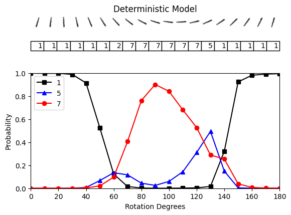 | 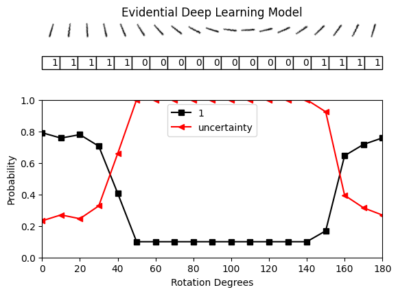 |
| Classify "1" | 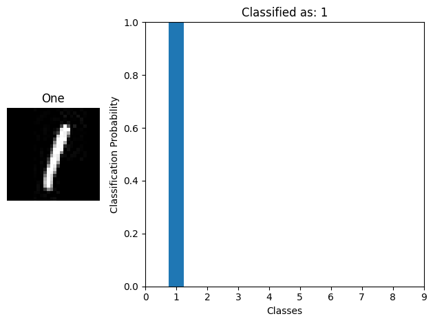 | 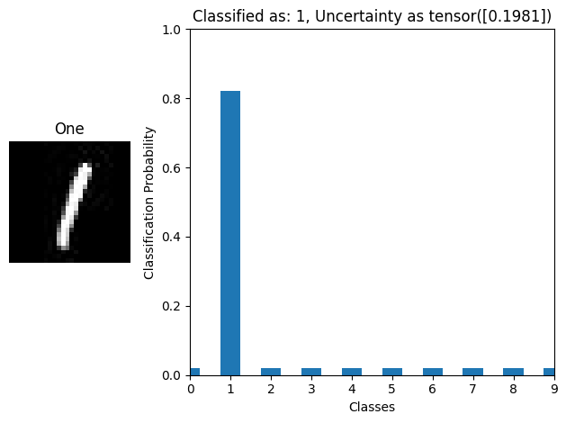 |
| Classify "Yoda" | 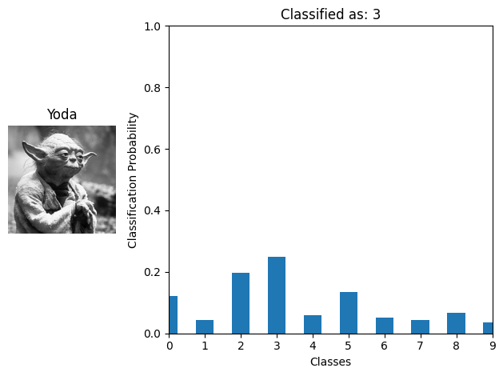 | 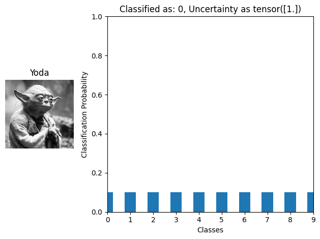 |


### Different Evidence Functions

| Evidence Function | Rotated One Experiment |
| ----------------- | ---------------------- |
| `relu(x)`         |  |
| `softplus(x)`     | 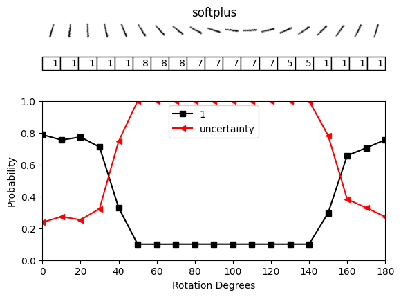 |
| `exp(x)` (clamped) | 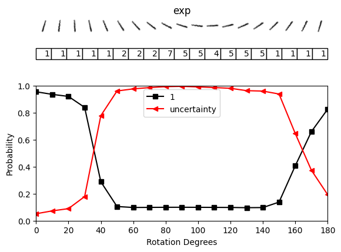 |
| `exp(tanh(x) / tau)` | 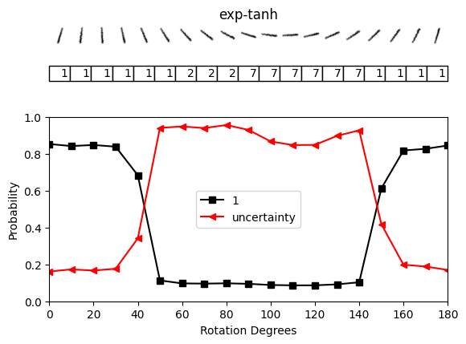 |

### Different Loss Functions

Implemented `SSE`, `NLL`, and `CE` loss functions for classification task.
Following the original paper, the default loss function used in the project is `SSE`.
However, I've experimented with the other loss functions as well.

| Loss Function | Rotated One Experiment |
| ---------- | -------- |
| `SSE` (`relu`) |  |
| `NLL` (`exp`) | 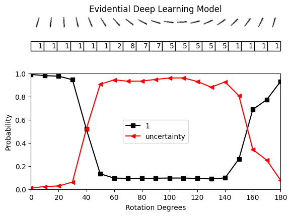 |
| `CE` (`exp`) | 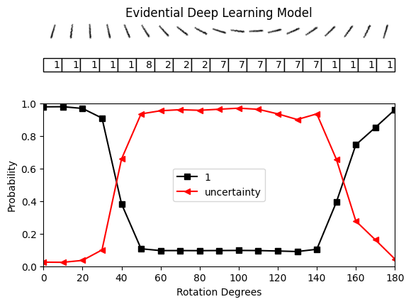 |
| `Relaxed SSE` (`softplus`) | 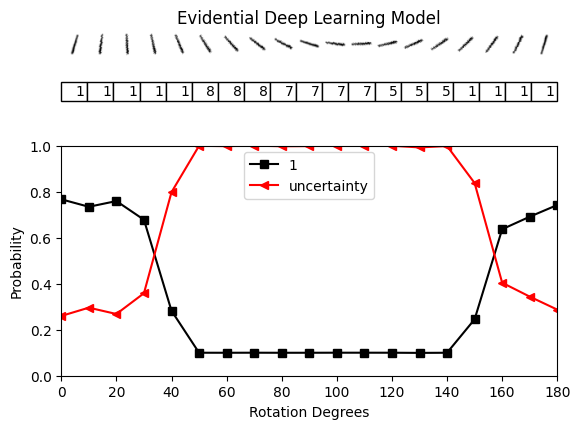 |

Note that choosing the loss function also requires choosing the right evidence function.
For example, it is said that `SSE` works well with `softplus` (and maybe `relu`), while `CE` works well with `exp`.
Recent applications to CV tasks have shown that `CE` works well with `exp(tanh(x) / tau)`.


### CIFAR-5 Experiments

Instead of LeNet5, I used ResNet18 for CIFAR-5 experiments.

Uncertainty thresholded accuracy plot:

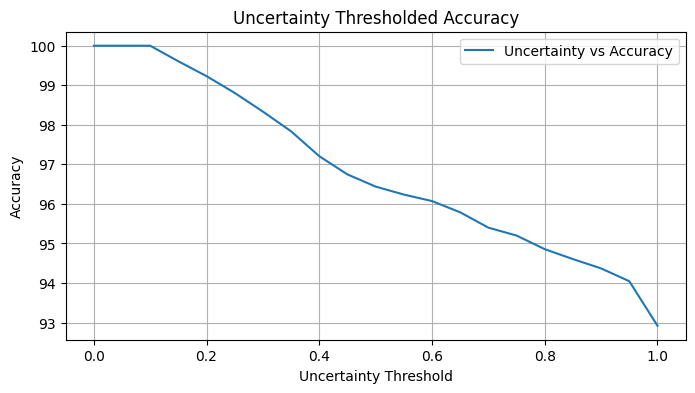

Empirical Cumulative Distribution Function (ECDF) of the uncertainty estimates:

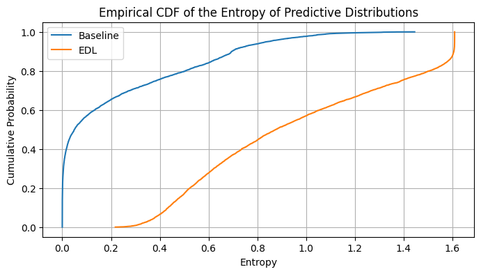

## Acknowledgement

- [evidential-learning-pytorch](https://github.com/teddykoker/evidential-learning-pytorch)
  - Referenced the implementation for Evidential Deep Learning which I ported to `mmpretrain`.
- [pytorch-classification-uncertainty](https://github.com/dougbrion/pytorch-classification-uncertainty)
  - Borrowed experimental setup and visualization code.
