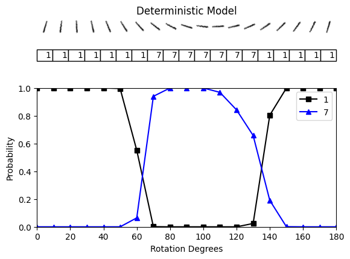
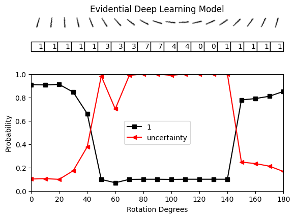
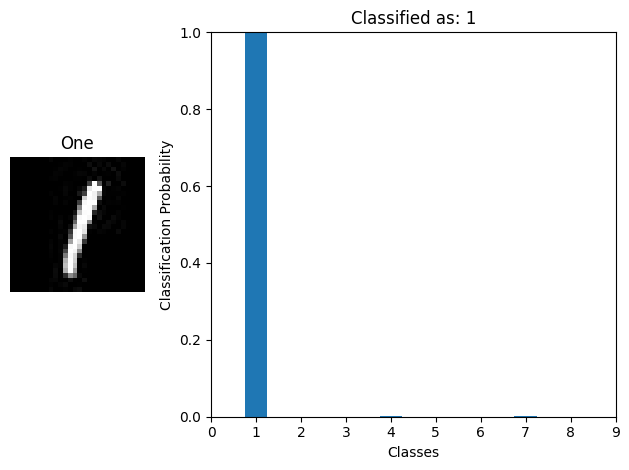
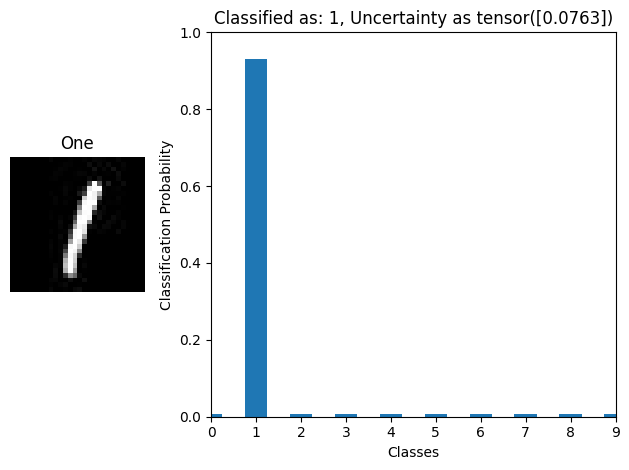
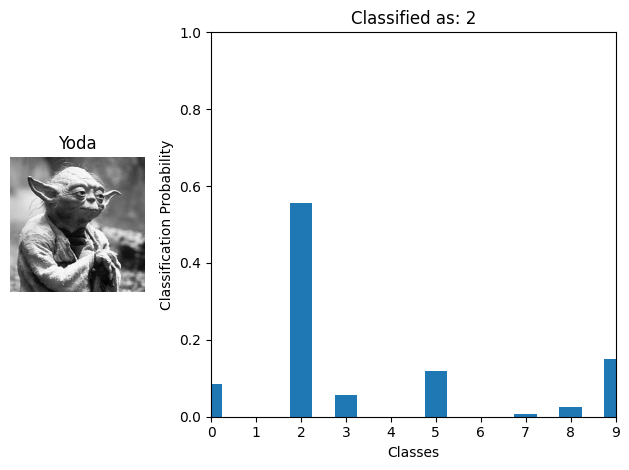

# Evidential Deep Learning

Experiments for Evidential Deep Learning (EDL)

The paper can be accessed at [arXiv](http://arxiv.org/abs/1806.01768).

The goals of this project are:
- to reproduce the results of the paper
- for me to understand how EDL works and the capabilities
- to adapt EDL for other datasets

## Installation

Install `torch` (with gpu-support).
Tested for `cu117` version of `torch`:
```bash
pip install torch==1.13.1+cu117 torchvision==0.14.1+cu117 torchaudio==0.13.1 --extra-index-url https://download.pytorch.org/whl/cu117
```

Install dependencies:
```bash
pip install -r requirements.txt
pip install -U openmim
mim install "mmpretrain>=1.0.0rc8"
```

## MNIST Example

### Training classifiers

```python
# softmax baseline
python tools/train.py configs/edl_mnist/default_lenet5_mnist.py

# edl
python tools/train.py configs/edl_mnist/edl_lenet5_mnist.py
```

### Visualization

Checkout `notebooks/exp_edl_mnist.ipynb` to visualize the results.

| Experiment | Softmax  | Evidential Deep Learning |
| ---------- | -------- | -------- |
| Rotate "1" |  |  |
| Classify "1" |  |  |
| Classify "Yoda" |  |  |

I've noticed that EDL is very sensitive to how it is trained.
For example, when I used the Adam optimizer for training, the model accuracy improves, but the uncertainty estimates are not as good as when I used SGD.


## Acknowledgement

- [evidential-learning-pytorch](https://github.com/teddykoker/evidential-learning-pytorch)
  - Referenced the implementation for Evidential Deep Learning which I ported to `mmpretrain`.
- [pytorch-classification-uncertainty](https://github.com/dougbrion/pytorch-classification-uncertainty)
  - Borrowed experimental setup and visualization code.
